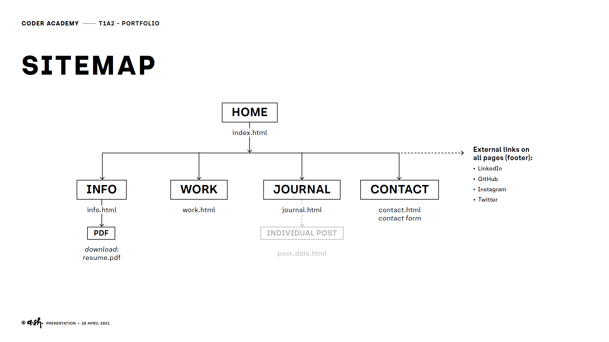
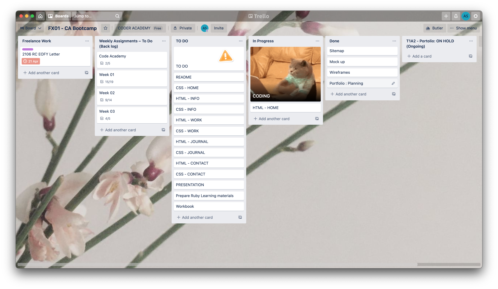
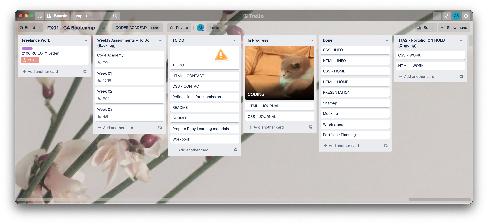
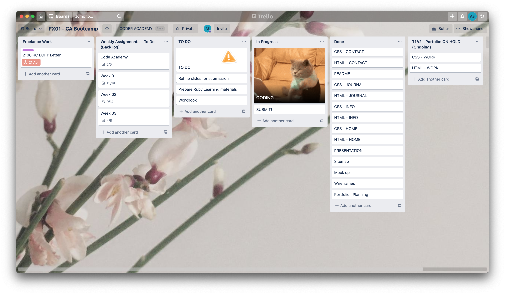
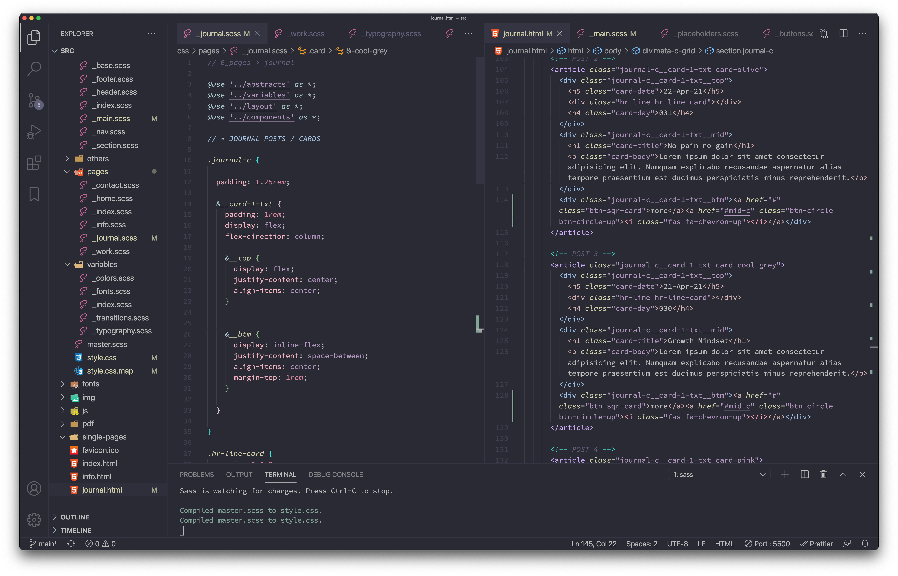
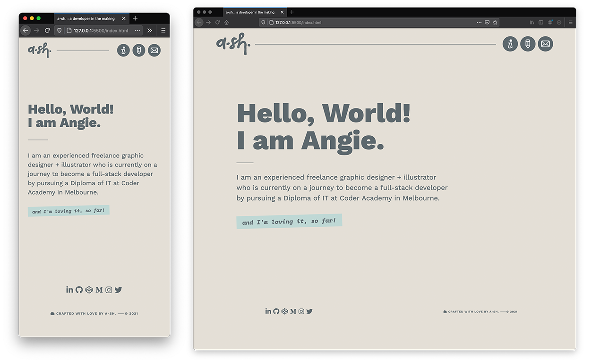
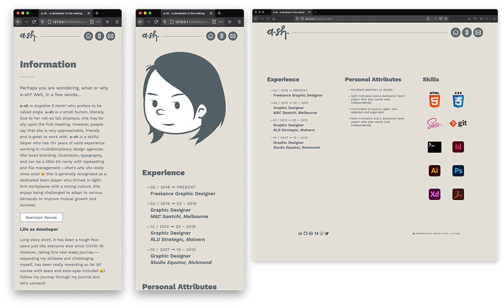
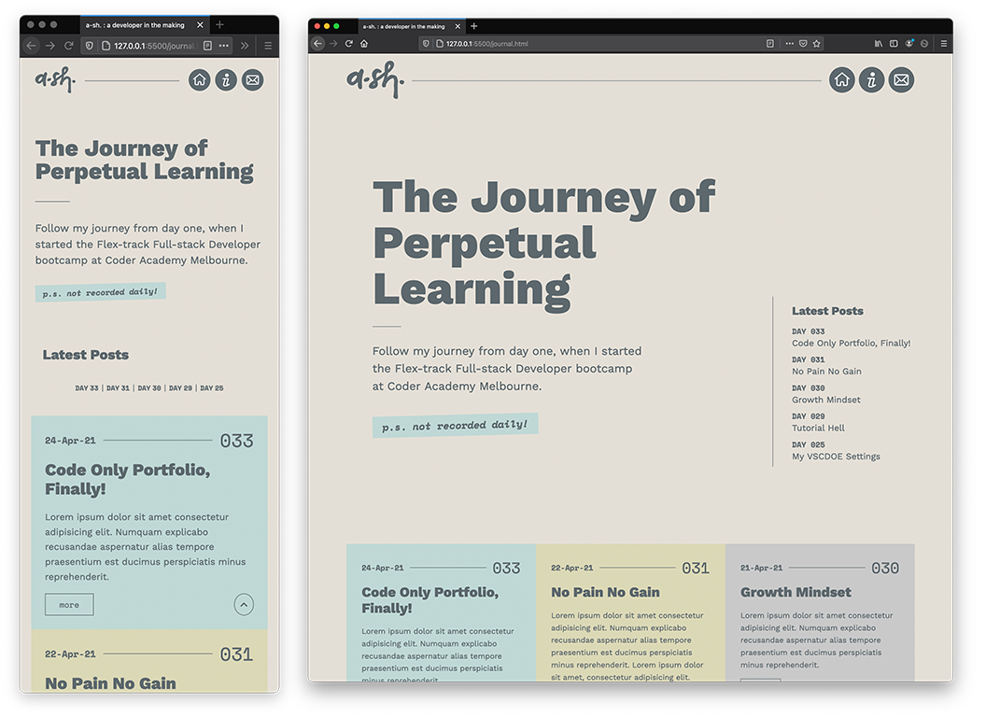
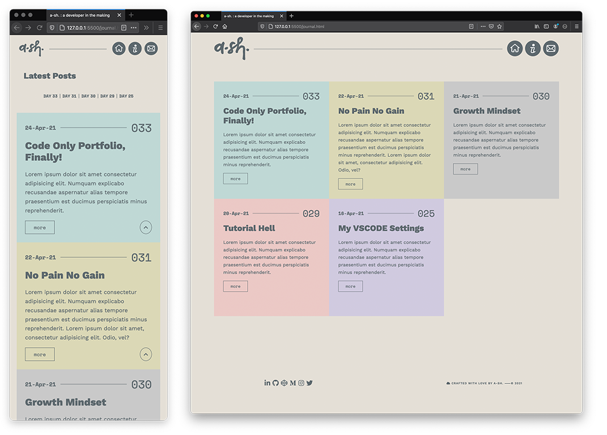
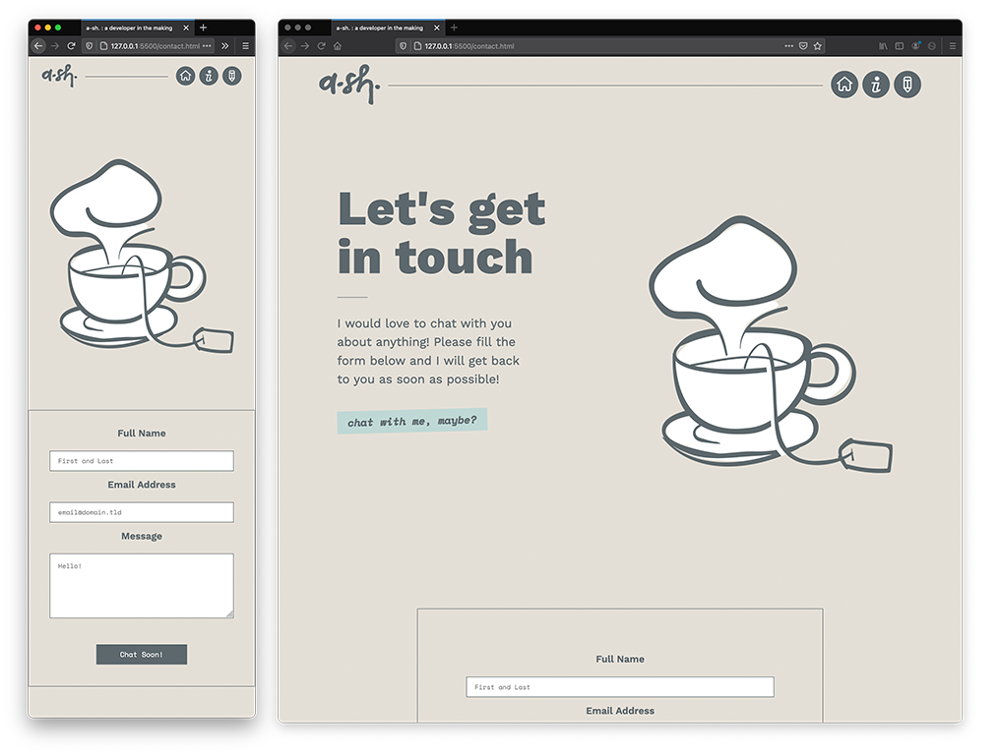

# T1A2 – Portfolio Project 

## Project Documentation

<small>*The following documentation is based on the initial version (version 1) of this website*</small>

A link (URL) to published portfolio website:

```
https://a-sh-t1a2.netlify.app/ 
```

<a href="https://a-sh-t1a2.netlify.app/" target="_blank">Go to live website</a>

A link to the GitHub repo 

```
https://github.com/a-sh-dev/T1A2_Portfolio
```

## Description

### **Purpose**

- Showcase work for potential employers
- Share journey and experience to the world as an aspiring full-stack developer who has graphic design background, and used to work a lot with front-end developers in the past.
- As a platform for an ongoing project to continuously craft my coding skills (especially scss/css as I found things are challenging to be implemented – no wonder many developers actually dislike, and even hate graphic designers for being too 'pedantic' with their design mock-up 😅).
  - E.g. It's challenging to implement the exact positioning or the same exact look as the original high-fidelity mock-up.
  - Front-end web development is more 'dynamic', especially in responsive layout as compared to static graphic design layout – therefore as a print designer I can truly empathise how challenging and more time consuming it is for developing the design into a website. I gain more respect now for Developers!

### **Functionality / Features**

- Simple interactive features on buttons and links
- Calming pastel colors – good for your eyes ✨ 
- Images / illustrations. I originally planned to have a cloud background but had problem to sucessfully implement it. Also attempted to create a image change on hover on the profile – this will be revisited.
- Contact form for ease of getting in touch and also for personal privacy issues of not exposing the email address to public and scam-bots.
- Sticky navigation for better accesibility. 

### **Sitemap**



- Original planned sitemap. 
- `work.html` is postponed – overall number of link pages is still within the requirement, four including `index.html`
- Journal – may have individual pages to the post that is long.
  - I also intend to have the journal page to mix 'blog posts' and some artworks / design work / photos that I want to publish – just like an art gallery.

### **Screenshots**







- Trello screenshot – for project management.



- Having fun with `scss` and implementing the new module system `@use`.


**Screenshots – Finished Website**

#### Home `index.html` 



#### Information `info.html`



#### Journal `journal.html`





#### Contact `contact.html`



- For more screenshots such as planning stage, wireframes and so on, please refer to the presentation slides profided in the `ppt` folder.

### **Target audience**

- Future and potential employers
- New developers / beginners, especially graphic designers
- Anyone! 😀

### **Tech stack**

- **HTML5** – with *Semantic* tag elements for better accesibility.
- **CSS3 through SCSS** (*Dart* version, which includes the new module system - `@use` implemented as supposed to `@import` that has been deprecated) – this is useful for other developers to pick up the project. Sass makes the css organised better.
- **Font Awesome** – third-part api for added UI features, such as the use of icons for convenient implementation from developer side and also to add aesthetics to the website overall look.
- **SVG** – Using `.svg` file type for some of the graphic that I made myself – these files are very small in size and great for keeping the image quality, as vector files won't be pixelated.
- **Google fonts** – two fonts: san-serif & monospace
- **Interactivity** – Light interactivity on buttons and menu. 
- **Netlify deployment platform** – personally I am not ready to deploy this to the world as they are not exactly as how I wanted it to be (yet)! Hence, I may purchase the domain name once things are fixed and improved! (PDF resume is only a placeholder for now)

## Personal Reflections

- It was my mistake to dwell into the ***Tutorial Hell***, a term and a common thing for new developers I didn't know about until my educator told me about it during my presentation.
- This is absolutely not a finish product. As I read more about the issue of being insecure to code  that many new developers are experiencing (hence the ***Tutorial Hell*** syndrome since I started the bootcamp), this project will be an ongoing side-project for me. As I learn more and grow, hopefully I can fix all the issues I face in *scss*, and to craft better and cleaner way of developing the website that hopefully is also organised enough for other developers to pick them up ✨ 
- Pleased that I finally able to craft and build my website with codes only. In the past I only built it through the help of *Dreamweaver* 🙈